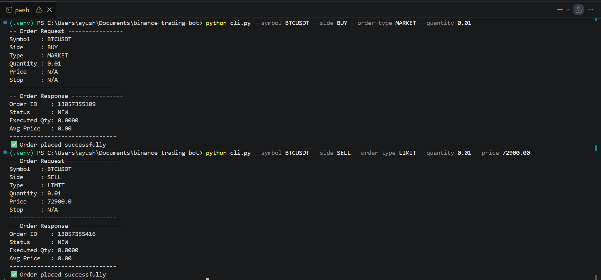
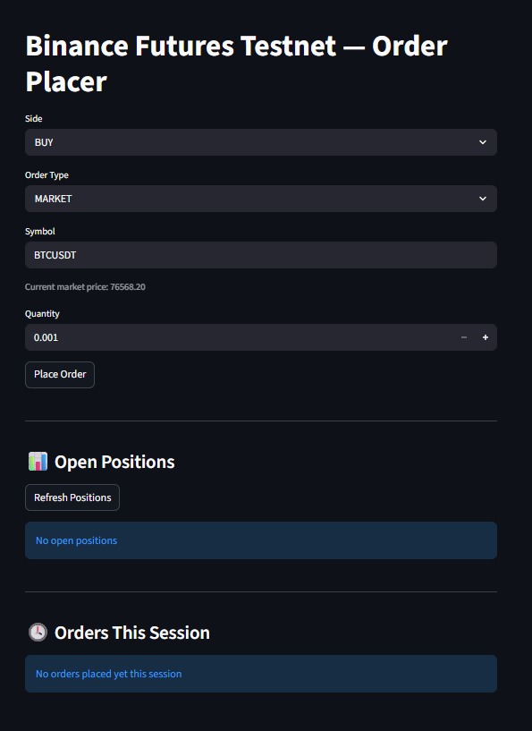
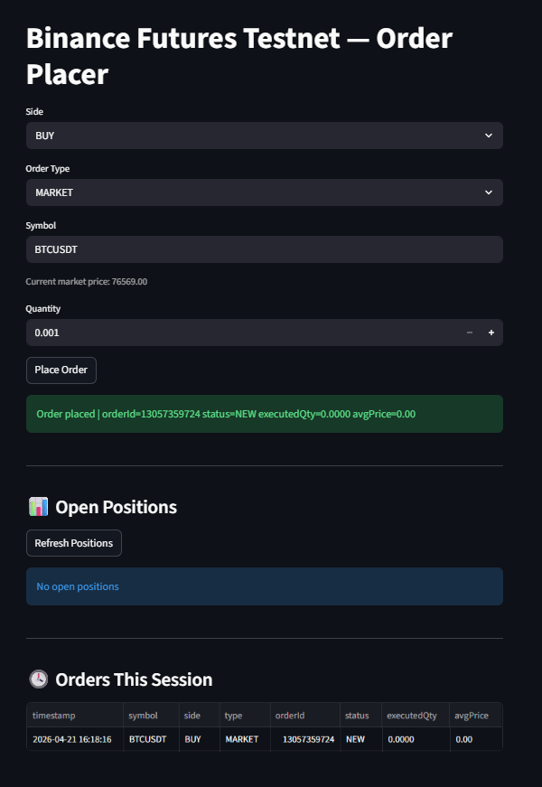
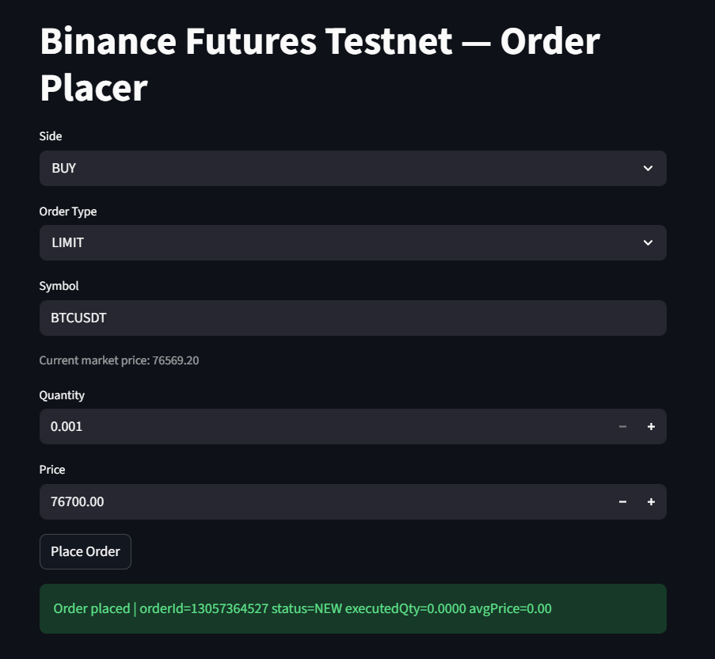
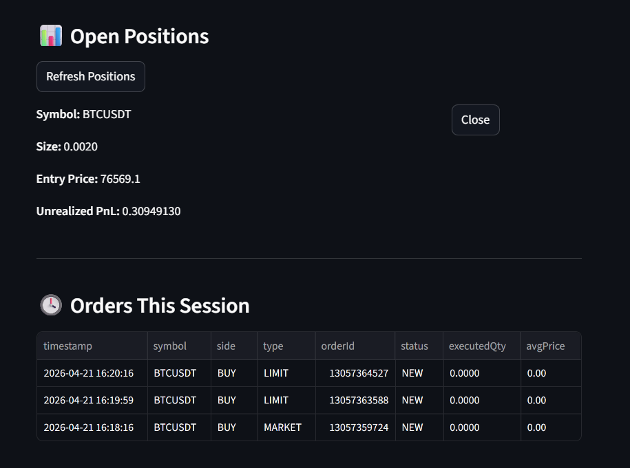

# Binance Futures Testnet Trading Bot

## Overview
This is a Python project for placing Binance USDT-M Futures orders on the Binance Futures Testnet. It includes both a CLI and a Streamlit UI, and supports MARKET and LIMIT order placement.

## Project Structure
```text
binance-trading-bot/
├─ app.py
├─ cli.py
├─ README.md
├─ requirements.txt
├─ .env.example
├─ .gitignore
├─ binance-skill.md
├─ bot/
│  ├─ __init__.py
│  ├─ client.py
│  ├─ logging_config.py
│  ├─ orders.py
│  └─ validators.py
└─ logs/
```

## Setup
- Clone the repo.
- Install dependencies:

```bash
pip install -r requirements.txt
```

- Copy the environment template and fill in your testnet API keys from https://testnet.binancefuture.com:

```bash
cp .env.example .env
```

- How to get testnet keys: create a Futures Testnet account, then generate API keys from the account's API Management page.

## CLI Usage
MARKET buy order:

```bash
python cli.py --symbol BTCUSDT --side BUY --order-type MARKET --quantity 0.01
```

LIMIT sell order:

```bash
python cli.py --symbol BTCUSDT --side SELL --order-type LIMIT --quantity 0.01 --price 50000
```

Validation failure example (missing required LIMIT price):

```bash
python cli.py --symbol BTCUSDT --side SELL --order-type LIMIT --quantity 0.01
```

CLI screenshot:



## Streamlit UI
Start the UI:

```bash
streamlit run app.py
```

Features:
- Order form for MARKET and LIMIT orders
- Live price ticker for the selected symbol
- Open positions panel
- Close position action (market close in opposite direction)
- Session order history (in-memory per browser session)

Streamlit UI screenshots:
- Starting Interface (up)


- Market Order Demo (up)


- Limit Order Demo (down)


- Open Postitions and Order History Logging (down)


## Design Decisions
- Why python-binance over raw requests? It provides a higher-level abstraction, handles request signing/authentication, and supports a `testnet=True` switch for the Futures Testnet endpoint.
- How is input validated? A dedicated `validators.py` layer validates and normalizes inputs before any API call, used in both the CLI and Streamlit UI.
- How are errors handled? `BinanceAPIException` (API errors) and `BinanceRequestException` (network errors) are handled explicitly, logged, and surfaced with clean user-facing messages.
- Why Typer for CLI? It provides typed options, generates `--help` automatically, and supports clean exit behavior for validation/API failures.
- Why is the client a wrapper class? It centralizes testnet configuration, environment loading, and logging in one place, and makes it straightforward to swap to mainnet later.
- How does logging work? A dual-handler logger writes INFO-level events to a file and WARNING+ to the console, and logs both outgoing request parameters and raw API responses.

## Assumptions
- USDT-M Futures testnet only.
- Quantity is in base asset units (for example, BTC for `BTCUSDT`).
- Limit price must be within the exchange PERCENT_PRICE filter range.
- Testnet accounts reset periodically; regenerate keys if you see authentication errors.

## Sample Log Output
```text
2024-04-21 10:23:01 | INFO | trading_bot | Placing order | symbol=BTCUSDT side=BUY type=MARKET qty=0.01
2024-04-21 10:23:02 | INFO | trading_bot | Order response | id=123456 status=FILLED execQty=0.01 avgPrice=43210.5
```
